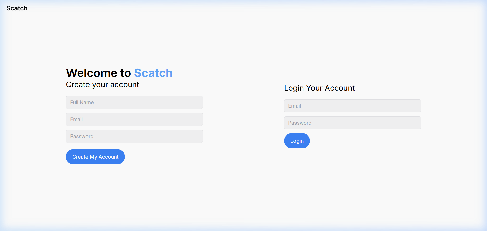
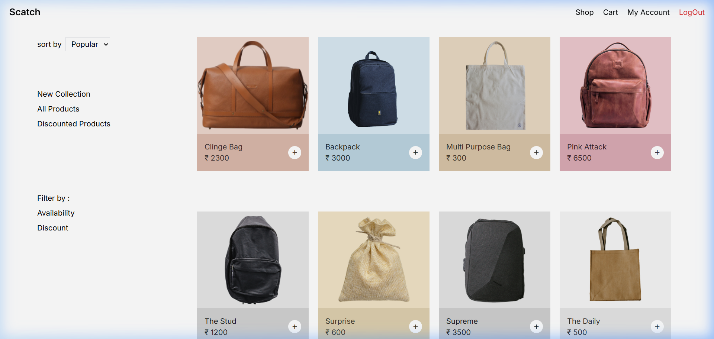
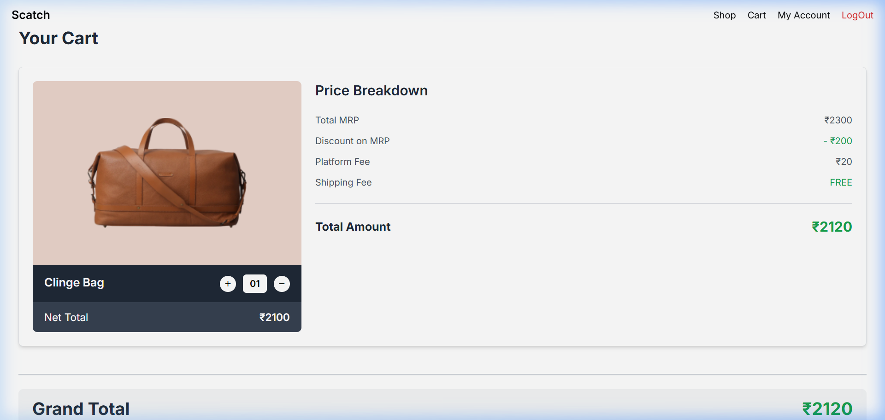
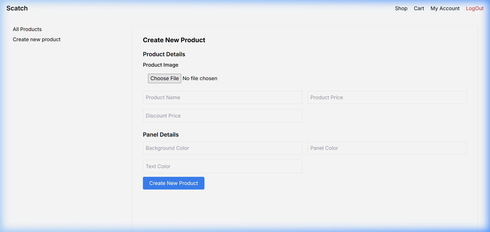

# Scatch - Premium E-Commerce Experience 🛍️

Scatch is a modern, full-stack e-commerce platform built with Node.js and Express. It features a sleek design, robust authentication, and a seamless shopping experience for both users and administrators.



## 🚀 Features

### **For Users**
- **Seamless Authentication**: Secure signup and login using JWT and Bcrypt.
- **Dynamic Shop**: Browse products with a clean, grid-based layout.
- **Shopping Cart**: Add and remove items from your cart with real-time price calculation.
- **Flash Feedback**: Get instant notifications for actions like "Added to cart" or "Login failed".
- **Responsive Design**: Optimized for all screen sizes.

### **For Owners (Admin)**
- **Product Management**: Create new products with images, custom prices, and styling options.
- **Admin Dashboard**: Effortlessly manage the store's inventory and settings.
- **Ownership Control**: Restricted admin creation to ensure security.

## 🛠️ Tech Stack

**Backend:**
- **Node.js & Express.js**: Core server and routing.
- **MongoDB & Mongoose**: Scalable NoSQL database integration.
- **JSON Web Token (JWT)**: Secure user sessions and authentication.
- **Bcrypt**: Advanced password hashing.
- **Multer**: Handling multipart/form-data for product image uploads.
- **Connect-Flash**: Session-based messaging for user feedback.

**Frontend:**
- **EJS (Embedded JavaScript)**: dynamic template rendering.
- **Vanilla CSS**: Custom, premium styling without external frameworks.
- **JavaScript**: Client-side interactions and form validation.

## 📸 Screenshots

### **1. Landing Page**
A minimalist and inviting landing page for users to join the platform.


### **2. Shop Gallery**
Explore a curated collection of premium bags and accessories.


### **3. Shopping Cart**
Intuitive cart management with a detailed price breakdown including discounts and fees.


### **4. Admin Panel**
A powerful interface for owners to manage items and update the storefront.


## ⚙️ Installation & Setup

1. **Clone the repository:**
   ```bash
   git clone https://github.com/YashveerRajput/Scatch.git
   cd Scatch
   ```

2. **Install dependencies:**
   ```bash
   npm install
   ```

3. **Set up Environment Variables:**
   Create a `.env` file in the root directory and add the following:
   ```env
   MONGODB_URI=your_mongodb_connection_string
   JWT_KEY=your_secret_key
   EXPRESS_SESSION_SECRET=your_session_secret
   NODE_ENV=development
   ```

4. **Run the application:**
   ```bash
   node app.js
   ```
   Open `http://localhost:3000` in your browser.

## 📂 Project Structure

```text
├── config/             # DB Connection Logic
├── controllers/        # Route Handlers
├── middlewares/        # Auth & Security Middlewares
├── models/             # Mongoose Schemas (User, Product, Owner)
├── public/             # Static Assets (CSS, Images, JS)
├── routes/             # API Endpoints & Page Routes
├── views/              # EJS Templates
├── app.js              # Application Entry Point
└── package.json        # Dependencies & Scripts
```

## 📄 License

This project is licensed under the ISC License.

---
Created with ❤️ by [Yashveer Rajput](https://github.com/YashveerRajput)
